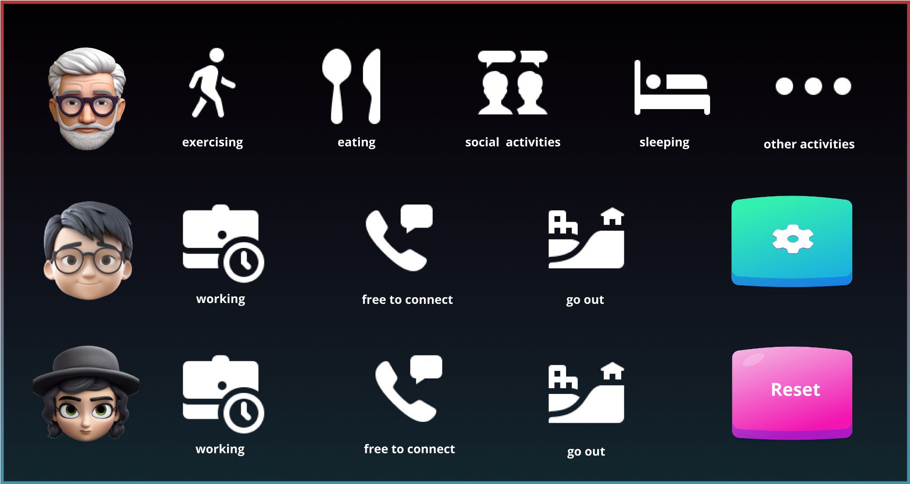

# CASA0021: Connected Environments Group Prototype and Pitch
## WorryFree  Project Final Report


---

```
Hongbing Qiu
ID： 24065411
Qiqing Dai 
ID：24171014
Ying Wu
ID: 23074009
Ximing Feng
ID: 24041372
```

Word Count: 2188 words

GitHub URL: https://github.com/mk20661/WorryFreeLink

---

## 1. Introduction
### 1.1 Background
As healthcare and living standards continue to improve, the global ageing population is growing rapidly, leading more families to face challenges in caring for the elderly. According to the United Nations’ World Social Report 2023, the number of people aged 65 years or older is expected to double over the next three decades, reaching 1.6 billion by 2050, when older adults will make up more than 16% of the global population. Therefore, to achieve a sustainable future, it is essential to prioritise the rights and well-being of older people.

At the same time, adult children often live apart from their ageing parents due to work, education, or fast-paced lifestyles, making consistent communication both essential and difficult. Elderly parents living alone may wish to keep their children informed about their well-being, but are often reluctant to interrupt their children’s busy routines. Meanwhile, demanding schedules make it difficult for children to maintain frequent phone or video contact. In this context, there is a growing need for a simple, real-time communication system that enables emotional connection between elderly parents and their children.

### 1.2  Motivation
There are some tech products on the market designed specifically for older adults. One of them is KOMP, a one-button device that allows family members to send photos, messages, and make video calls. However, its interactivity is limited and not truly two-way, as the elderly user initiates most communication. Additionally, the device is quite expensive, costing £599 with a mandatory £19 monthly subscription, which may not be affordable for many families(Komp.family, 2025).

Secondly, traditional technology products and contact methods have shortcomings in terms of age adaptability. Because many elderly people are unable to use technology products and are concerned about disturbing their children, the demand for a simple device to communicate with them has increased significantly. This makes it of great significance to develop a new product with simple functions that are easy for the elderly to understand and operate, and that can communicate with their children without disturbing them.

### 1.3  Aims and Objectives
The goal of the project is to develop a two-way intelligent connected interactive device that helps elderly people reduce communication anxiety and unease caused by the fear of disturbing their children, achieve worry free connection between the elderly and their children, and provide our user group with an aging friendly user experience that is in line with their usage habits.

Project Development Plan:
- Software Objective:
    - Design a simple and intuitive UI that conforms to the usage habits of the elderly. The UI also needs to reflect the real-time status and user interaction when switching.
    - Develop a stable and reliable real-time data synchronisation function to ensure real-time updates of interactive information between devices.
- Hardware Objective:
  - Implement high-performance and low-power circuit designs to ensure the device's battery life meets the daily needs of the elderly population.
- User experience objectives:
  - Using primary and secondary research methods such as questionnaire surveys and user interviews to identify the core pain points of user groups
  - Conduct SWOT analysis on market competitors, iterate our equipment to meet market demand
  - Ensure that the device is easy to operate, has clear and direct interaction, and is easy for the elderly to understand
- Feasibility analysis of the project:

<p align="center">
  <br/>
  <b>Table 1:</b> Feasibility analysis
</p>

- Analysis of Materials Required for the Project
  <p align="center">
  <br/>
  <b>Table 2:</b> Materials Analysis
  </p>

- Project schedule:
  <p align="center">
  <br/>
  <b>Table 3:</b> Team Schedule
  </p>

---

## 2. Literature review
Technology plays an increasingly vital role in facilitating communication between elderly individuals and their families. In particular, Ambient Assisted Living (AAL) systems that leverage Internet of Things (IoT) technologies have shown great promise as supportive tools for enhancing the quality of life and independence of older adults (Caballero et al., 2024).

However, the effectiveness of such technologies is often limited by the relatively low rate of smartphone usage among older adults. Age-related issues, such as declining near vision, make it difficult for seniors to read small text or navigate complex smartphone interfaces. In addition, many elderly individuals perceive smartphones as overly complicated and burdensome to learn. In a study conducted by Busch (2021), most older adult participants reported using their smartphones for less than two hours per day.

Given these challenges, recent studies in human-computer interaction emphasize the importance of simple and intuitive interface design for older users. Yeh (2020) found that button position and font size significantly affected the performance of elderly participants when operating touchscreen devices. Specifically, older adults performed best when buttons were placed at the top of the screen and when the font size was increased to 22 points. These findings suggest that minimalist interfaces, such as those featuring larger text and well-positioned buttons, can effectively reduce cognitive load and accommodate sensory limitations, thereby improving usability and technology acceptance among ageing populations.

---

## 3. Design Process & Iterations
### 3.1 Initial Design Proposal
At the beginning of the project, the aim was to design a simple and intuitive UI that primarily utilises large icons for elderly people to quickly understand, based on our insight into the pain point of elderly people being afraid of disturbing their children and lacking communication with them. In the first version of the UI, the diversity of contact was mainly highlighted, providing the five most common activities for the elderly, as well as options for their children's work status and available contact status.

  <p align="center">
  <br/>
  <b>Figure 1: </b>Version 1
  </p>

### 3.2 UI Design
#### 3.2.1  First iteration
Based on user feedback and teacher suggestions, although it contains a lot of information, it does not align with the usage habits of the elderly in terms of user experience. Considering the situation where a family has multiple children, we have reduced the switchable function for the elderly to three options, changed the status of the children to only work and available for contact, and added LED light switching that is suitable for families with multiple children.

  <p align="center">
  <br/>
  <b>Figure 2: </b>Version 2
  </p>

#### 3.2.2  Second iteration
In further changes to the interface, user pain points are constantly being refined. A very important point is that in communication between the elderly and their children, the contradiction lies in the elderly wanting to contact their children but being afraid to disturb them, while the children want to know if their parents are healthy. Therefore, a unique button has been designed on the UI. For elderly people, they only need to press a button to let their children know that their condition is good, while children only need to press a button to let their parents know that they are in a good state.

  <p align="center">
  <br/>
  <b>Figure 3: </b>Version 3
  </p>

### 3.3 Product Modelling
The final high-fidelity UI underwent two major iterations and ultimately formed a simple and easy-to-use interface. To meet the usage habits of the elderly, improve usability, and reduce the cognitive load of the product, while adhering to the principle of simplicity, have become key (Norman, 2013; Krug, 2014).

Based on this principle, it is necessary to minimise unnecessary complexity in the product modelling process and ensure that the elderly can interact with the system intuitively without a steep learning curve. Secondly, to improve the safety of user use, the corners of the product are designed with no sharp edges (ISO 12100:2010), and to make it easy to integrate into the user's home space as a home product, contemporary minimalist design is combined in line with aesthetic trends (Baghirov&Zhang, 2024).

  <p align="center">
  <br/>
  <b>Figure 4:</b> Product Sketch
  </p>

  <p align="center">
  <br/>
  <b>Figure 5:</b> 3D printing process 
  </p>

  <p align="center">
  <br/>
  <b>Figure 6:</b> Modelling Prototype
  </p>

  <p align="center">
  <br/>
  <b>Figure 7:</b> Final Device 
  </p>  

---

## 4. Implementation & Reproducibility 
### 4.1 Hardware

For this project, the ESP32-WROOM-32D is selected as the central processing unit, responsible for data acquisition, lighting control, processing interaction logic, and communication tasks using the MQTT protocol. This chip features a dual-core processor and a high central frequency, providing excellent computing performance and meeting the system's requirements for real-time performance and response speed. Meanwhile, the ESP32 is equipped with Wi-Fi and Bluetooth communication modules and numerous GPIO pins, facilitating the driving of multiple external sensors and execution modules, which significantly enhances the system's scalability and integration. Its small size offers greater flexibility for the industrial design and space layout of the product. Moreover, its low price and high cost performance are well-suited to this project's goal of "low-cost prototype development” (Espressif Systems, 2023).

This project aims to present the status information of elderly people living alone and their children, and visually display the process of status switching between them using a lighting system. The system adopts two WS2812 RGB light strips to achieve flexible and transparent visual feedback. These light strips support single-line communication and point-by-point addressing control. They are easy to connect and have rich colour expressiveness, enabling diverse interactive lighting effects and enhancing the users' perception experience. Regarding interaction design, the system selects a large-sized push-button switch as the primary input method, focusing on the actual usage needs of elderly users. The large button's design helps improve operability, ensuring that users can accurately and efficiently complete operations even when their vision declines or hand strength weakens, thereby enhancing the system's usability and friendliness. As shown in Figure 7, the basic connection structure of the hardware part of this project is presented.

  <p align="center">
  <br/>
  <b>Figure 8:</b>  Circuit Diagram
  </p>  

### 4.2  Software
The overall control logic of this project is based on the "perception-judgment-response" cyclic mechanism, aiming to achieve real-time responses to user inputs and complete information synchronisation and interaction among multiple devices through the MQTT protocol.

After the system is started, each functional module will be initialised in sequence, including NeoPixel control for the light strip, button input reading, Wi-Fi connection, and MQTT client configuration, providing the necessary basic environment for subsequent operation. The system's operation logic is shown in Figure 8, following a precise state transition flow.

Firstly, the device completes module initialisation and attempts to connect to the Wi-Fi network (refer to Figure 9). If the connection fails, the system will automatically retry until it succeeds. Subsequently, the device establishes a connection with the MQTT server and enters the main loop, continuously listening for button input from the user. Once the button is pressed, the system will perform the following response operations: change the colour of the LED light strip to reflect the current status, and send this status information through the MQTT protocol to the server and other terminal devices. At the same time, the device has MQTT subscription capabilities, which can receive status messages from different devices and update its own LED display accordingly, achieving real-time synchronisation of multiple end statuses.

  <p align="center">
  <br/>
  <b>Figure 9:</b>  Operation Logic
  </p> 

 <p align="center">
  <br/>
  <b>Figure 10:</b> Wi-Fi Connection Setting
  </p> 

### 4.3  Optimisation

In the initial version, the dashboard featured 11 LED indicators and two buttons: red and green. On the software side, FreeRTOS was employed to implement multithreading for faster LED control and switching. Additionally, voice broadcasting was used to announce the activity corresponding to the pressed button, and the Wi-Fi SSID and password were directly programmed into the MCU.

However, during the iteration process, this version was found to be overly complex in terms of information delivery, making it unsuitable for communication between elderly users and children. Therefore, the final MVP (Minimum Viable Product) was optimised as follows:
- The number of LEDs was reduced to 5, and the two buttons were replaced by a single large red button.
- The FreeRTOS structure was removed, and the code controlling the LEDs was simplified.
- The ESP32’s AP (Access Point) mode was utilised, enabling users to input Wi-Fi credentials via a smartphone dynamically.
- The voice broadcasting functionality was removed.

This optimisation process not only made the product better aligned with principles of age-friendly design but also significantly reduced development and manufacturing costs. It clarified the product's core functions by eliminating redundant features, thereby enhancing ease of use for elderly users.

---
## 5  Conclusions and future work

### 5.1 Conclusions
This project serves as a communication bridge between elderly individuals living alone and their family members. It effectively addresses intergenerational communication challenges, particularly those arising from the elderly’s unfamiliarity with smartphones and the time constraints faced by their children due to busy work schedules.

The dashboard's design incorporates age-friendly principles. Features such as a prominent red button and a clean, intuitive user interface are specifically tailored to help elderly users easily understand the product's purpose and functionality.
 
From a hardware and software perspective, cost-effectiveness was a primary consideration. By utilising a simple circuit design and a microcontroller unit (MCU), this product successfully limited the production cost to £18.5 per unit.
 
Overall, as an initial prototype and minimum viable product (MVP), the current iteration of the system has met our expectations in terms of both functionality and user accessibility.


### 5.2 Future work
As a Minimum Viable Product, the current version of the project successfully addresses key user pain points and is ready for deployment. However, two critical issues remain to be resolved in future development. Here, we present the issues and preliminary solutions:

- The two avatars displayed on the dashboard currently lack clear meaning and may confuse users.


- Three LED indicators represent the child section on the dashboard; it is unclear how the system should accommodate families with more than three children.

To address these issues, future iterations of the product will focus on enhancing customisation features.

First, the two conceptual avatars on the dashboard will be eliminated in future versions, as they introduce unnecessary confusion for users. Instead, customisable magnetic widgets will be provided, allowing users to personalise the dashboard according to their needs. These widgets could feature family member photos, names, or other symbols representing each individual. Children can place their personalised magnetic widgets below their respective LED indicators. This approach enables elderly users living alone to easily recognise which child is available for communication without needing to memorise the association between specific LEDS and family members. Moreover, this strategy enhances the product's flexibility and personalisation.


  <p align="center">
  <br/>
  <b>Figure 11:</b>  Operation Logic
  </p> 

 <p align="center">
  <br/>
  <b>Figure 12:</b> Wi-Fi Connection Setting
  </p> 

### Reference
United Nations (2023). World Social Report 2023: Leaving No One Behind In An Ageing World. [online] UN DESA Publications. Available at: https://desapublications.un.org/publications/world-social-report-2023-leaving-no-one-behind-ageing-world.

Caballero, P., Ortiz, G. and Inmaculada Medina-Bulo (2023). Systematic literature review of ambient assisted living systems supported by the Internet of Things. Universal access in the information society. doi:https://doi.org/10.1007/s10209-023-01022-w.

Espressif Systems, 2023. ESP32-WROOM-32 Datasheet. Version 3.4. Available at: https://www.espressif.com/sites/default/files/documentation/esp32-wroom-32_datasheet_en.pdf [Accessed 20 Apr. 2025].

Busch, P.A., Hausvik, G.I., Ropstad, O.K. and Pettersen, D. (2021). Smartphone usage among older adults. Computers in Human Behavior, [online] 121, p.106783. doi:https://doi.org/10.1016/j.chb.2021.106783.

Yeh, P.-C. (2020). Impact of Button Position and Touchscreen Font Size on Healthcare Device Operation by Older Adults. Heliyon, [online] 6(6), p.e04147. doi:https://doi.org/10.1016/j.heliyon.2020.e04147.

Komp.family. (2025). Help Centre | Subscriptions and returns. [online] Available at: https://help.komp.family/subscriptions-and-returns [Accessed 22 Apr. 2025].

Norman, D. A. (2013). The Design of Everyday Things: Revised and Expanded Edition. Basic Books.

International Organization for Standardization. (2010). ISO 12100:2010: Safety of machinery — General principles for design — Risk assessment and risk reduction. ISO.

Baghirov, F., & Zhang, Y. (2024). Assessment of the association between aesthetic products and perceived product quality: an analysis of customer attitudes. Journal of Consumer Marketing, 41(7), 789–803. https://doi.org/10.1108/jcm-01-2024-6521

---